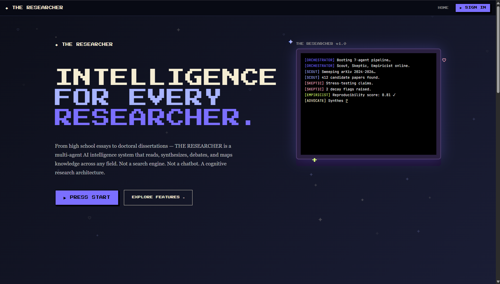
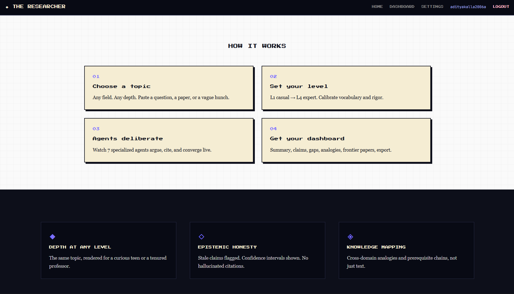
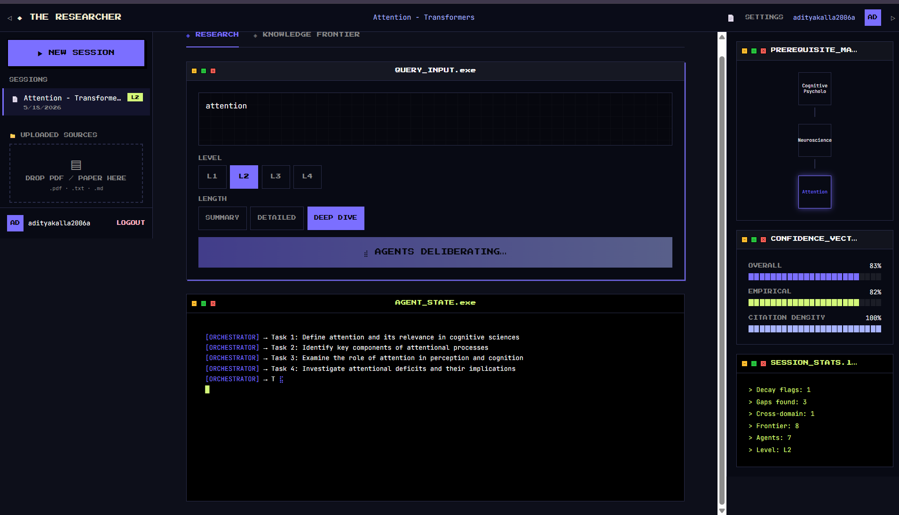
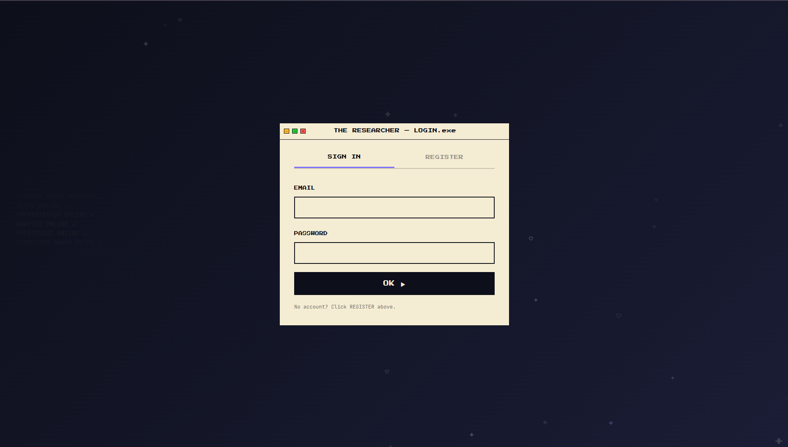
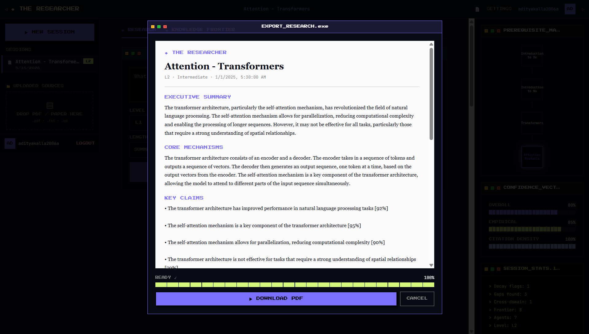

# 🤖 The Researcher | AI-Powered Engine

A sophisticated full-stack AI application designed to process and synthesize complex information. This project features a robust Node.js backend acting as an AI gateway and a modern, high-speed React frontend.

## 📸 Project Preview
*Visualizing the agentic workflow and research capabilities in local development:*

<p align="center">
  
  
</p>

<p align="center">
  
  
</p>

<p align="center">
  
</p>

---

## 🛠️ Tech Stack

### Frontend
- **Framework:** React with Vite
- **Routing:** TanStack Router (Typesafe routing)
- **State Management:** TanStack Store / Custom Hooks
- **Styling:** Tailwind CSS

### Backend
- **Runtime:** Node.js
- **API Handling:** Express.js / Native Node Server
- **Deployment Ready:** Configured for Cloudflare Workers (`wrangler.jsonc`)
- **AI Integration:** Secure API Gateway for Large Language Models

---

## 🚀 Local Setup Instructions

### 1. Clone the Repository
```bash
git clone [https://github.com/aditya-kalla/The-Researcher.git](https://github.com/aditya-kalla/The-Researcher.git)
cd The-Researcher

```

### 2. Backend Configuration

Navigate to the backend folder and set up your environment variables:

```bash
cd researcher-backend
npm install
cp .env.example .env

```

*Edit the `.env` file and add your secret AI API keys.*

### 3. Frontend Configuration

Open a new terminal and set up the UI:

```bash
cd researcher-frontend
npm install
npm run dev

```

---

## 🔐 Security & Architecture

* **Environment Isolation:** All sensitive API keys are managed via `.env` files and are strictly ignored by Git to prevent leaks.
* **Separation of Concerns:** A clean mono-repo structure separating the AI logic (Backend) from the User Interface (Frontend).
* **Type Safety:** Built with TypeScript to ensure robust data handling between AI responses and UI components.

---

## 📅 Roadmap

* [ ] **Database Integration:** Adding PostgreSQL/Supabase for persistent research history.
* [ ] **Cloud Deployment:** Deploying the backend to Cloudflare Workers using the existing `wrangler` config.
* [ ] **Export Feature:** Enhancing the PDF/Markdown download functionality.

---

## 👨‍💻 Author

**Aditya Kalla**

* **GitHub:** [@aditya-kalla](https://www.google.com/search?q=https://github.com/aditya-kalla)
* **LinkedIn:** [linkedin.com/in/aditya-kalla](https://www.google.com/search?q=https://linkedin.com/in/aditya-kalla)

---

*Built as part of my exploration into Agentic AI workflows.*

