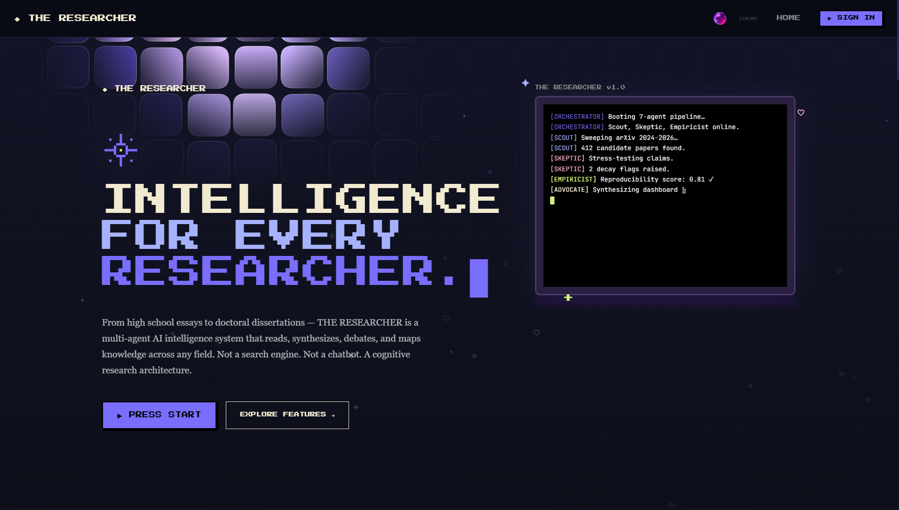
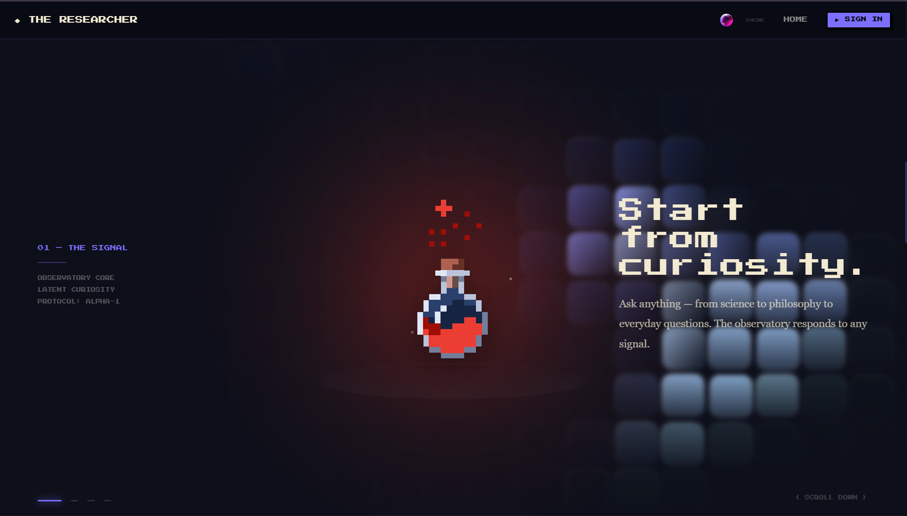
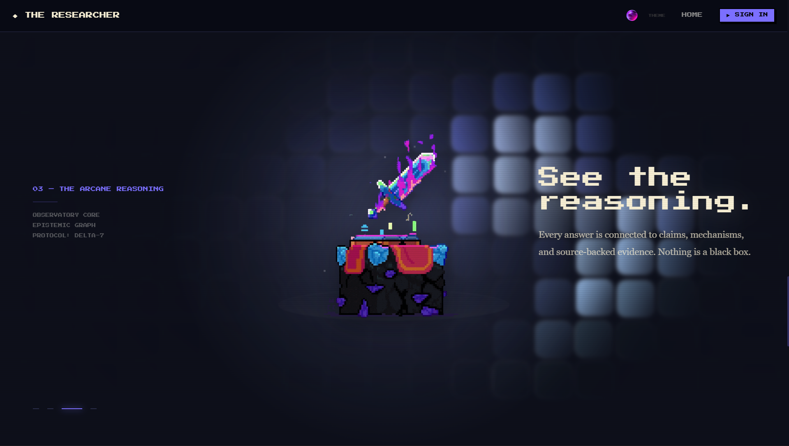
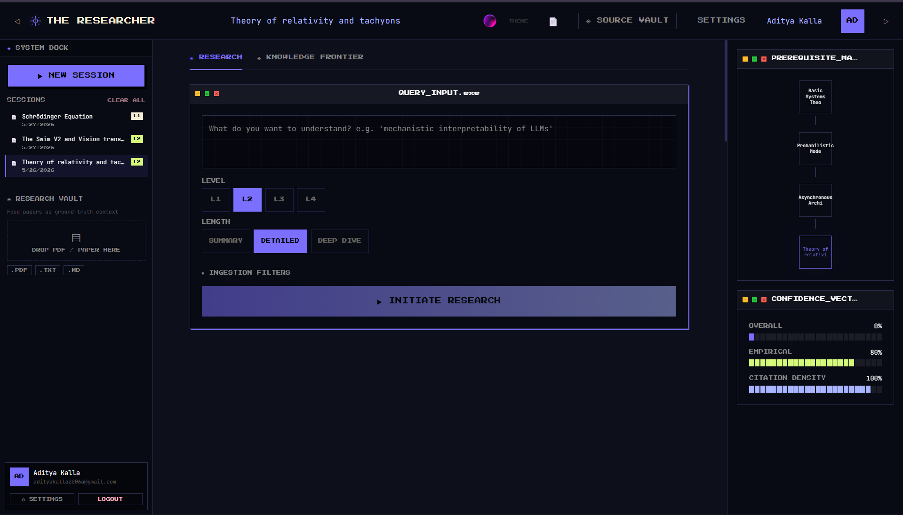
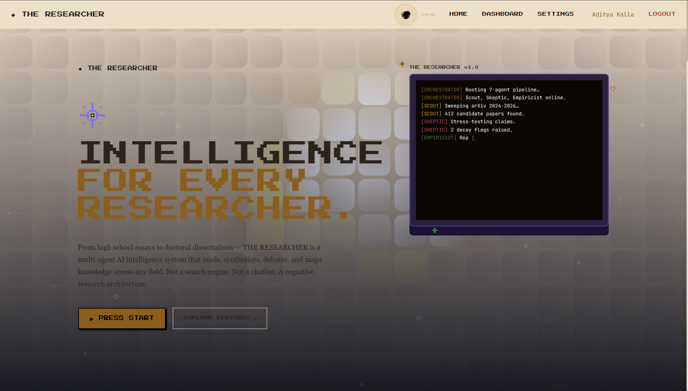

<div align="center">


<br />
<br />

```
◆ INTELLIGENCE FOR EVERY RESEARCHER.
```

**Not a search engine. Not a chatbot. A cognitive research architecture.**

From high school essays to doctoral dissertations — THE RESEARCHER is a multi-agent AI intelligence system that reads, synthesizes, debates, and maps knowledge across any field.

<br />

[](https://the-researcher-app.vercel.app)
[](https://github.com/aditya-kalla/The-Researcher/stargazers)
[](LICENSE)

<br />



</div>

---

## ◈ What is The Researcher?

THE RESEARCHER is an **Interactive Intelligence Observatory** — a cinematic, immersive AI research platform built around a simulated 7-agent council. You type a topic. Seven AI agents deliberate in real time. You get a full research dashboard: executive summaries, epistemic decay analysis, cross-domain analogies, knowledge frontier cards, and source-backed evidence.

It is designed to feel like:
- A cognitive research instrument
- A cinematic observatory
- An archival intelligence system
- An atmospheric pixel-computing interface

> *"Every answer is connected to claims, mechanisms, and source-backed evidence. Nothing is a black box."*

---

## ◈ Screenshots

<table>
<tr>
<td></td>
<td></td>
<td></td>

</tr>
<tr>
<td align="center"><sub>Landing — OBSERVATORY theme</sub></td>
<td align="center"><sub>Cinematic scroll story</sub></td>
</tr>
<tr>
<td></td>
<td></td>
</tr>
<tr>
<td align="center"><sub>Research Dashboard</sub></td>
<td align="center"><sub>LIGHT theme</sub></td>
</tr>
</table>

---

## ◈ The 7-Agent Council

Each research session deploys a council of specialized AI agents that deliberate in real time:

| Agent | Role |
|-------|------|
| `ORCHESTRATOR` | Decomposes the query into 5 research tasks |
| `SCOUT` | Sweeps literature, identifies grounding papers |
| `CLASSIFIER` | Routes complexity, builds the Knowledge Frontier |
| `GRAPH_ARCHITECT` | Finds cross-domain analogies and causal links |
| `ADVOCATE` | Marshals evidence, writes the executive synthesis |
| `SKEPTIC` | Stress-tests claims, flags epistemic decay |
| `EMPIRICIST` | Confidence-scores every claim, identifies research gaps |

---

## ◈ Features

**Research Dashboard**
- Executive Summary — multi-paragraph editorial intelligence briefing
- Core Mechanisms — structured mechanistic explanation with LaTeX equations (L3/L4)
- Key Claims — falsifiable, citation-grounded findings with confidence scores
- Epistemic Decay — stale vs. fresh claim tracking with superseding papers
- Cross-Domain Analogy — structural isomorphisms between unrelated fields
- Research Gaps — specific, actionable gaps with named methods and benchmarks
- Novel Hypothesis — AI-generated testable hypothesis (Level 4 only)
- Prerequisite Map — visual dependency chain for the topic

**Knowledge Frontier**
- 8 frontier cards per session: FOUNDATION, FRONTIER, WILDCARD, HARDWARE_BRIDGE
- Real paper links via Semantic Scholar API
- Source Vault drawer with epistemic traceability

**Platform**
- 4 themes: OBSERVATORY · LIGHT · DARK · NEO
- 4 complexity levels: Beginner → Intermediate → Advanced → Scientist
- 3 length modes: Summary · Detailed · Deep Dive
- Export suite: PDF · LaTeX · DOCX
- Firebase Auth (email/password + Google OAuth)
- Firestore session persistence + annotations
- Cinematic Sunny Eye observatory overlay
- Pixel atmospheric canvas (cursor-reactive, scroll-aware)

---

## ◈ Tech Stack

**Frontend**
- React + Vite + TanStack Router
- Tailwind CSS + custom CSS variable architecture
- Framer Motion
- Zustand (state management)

**Backend**
- Express.js (Node 18+)
- Groq API — `llama-3.3-70b-versatile`
- Multi-provider fallback: Groq → Gemini → OpenRouter → Cloudflare → NVIDIA
- Semantic Scholar API (real paper enrichment, no key required)

**Infrastructure**
- Firebase Auth + Firestore
- Deployed on Vercel (frontend) + Railway (backend)

---

## ◈ Getting Started

### Prerequisites

- Node.js 18+
- A Groq API key (free at [console.groq.com](https://console.groq.com))
- Firebase project (free tier works)

### Installation

**1. Clone the repo**
```bash
git clone https://github.com/aditya-kalla/The-Researcher.git
cd The-Researcher
```

**2. Backend setup**
```bash
cd researcher-backend
npm install
```

Create `.env` in `researcher-backend/`:
```env
GROQ_API_KEY=your_groq_key
PORT=3001
FRONTEND_URL=http://localhost:5173
FIREBASE_CLIENT_EMAIL=your_firebase_email
FIREBASE_PRIVATE_KEY="your_firebase_private_key"

# Optional — multi-provider fallback
GEMINI_API_KEY=
OPENROUTER_API_KEY=
CLOUDFLARE_API_TOKEN=
CLOUDFLARE_ACCOUNT_ID=
NVIDIA_API_KEY=
```

Start backend:
```bash
node server.js
```

**3. Frontend setup**
```bash
cd researcher-frontend
npm install
```

Create `.env` in `researcher-frontend/`:
```env
VITE_API_BASE_URL=http://localhost:3001
VITE_FIREBASE_API_KEY=your_key
VITE_FIREBASE_AUTH_DOMAIN=your_domain
VITE_FIREBASE_PROJECT_ID=your_project_id
VITE_FIREBASE_STORAGE_BUCKET=your_bucket
VITE_FIREBASE_MESSAGING_SENDER_ID=your_sender_id
VITE_FIREBASE_APP_ID=your_app_id
```

Start frontend:
```bash
npm run dev
```

Open `http://localhost:5173`

---

## ◈ Complexity Levels

| Level | Name | Description |
|-------|------|-------------|
| L1 | Beginner | Plain English, analogies-first, no jargon |
| L2 | Intermediate | Technical terms defined inline, conceptual math |
| L3 | Advanced | Full vocabulary, LaTeX equations required |
| L4 | Scientist | Expert-to-expert, full proofs, novel hypothesis |

---

## ◈ Roadmap

- [x] 7-agent AI council simulation
- [x] 4 themes (Observatory, Light, Dark, Neo)
- [x] Firebase Auth + Firestore persistence
- [x] Export suite (PDF, LaTeX, DOCX)
- [x] Semantic Scholar real paper links
- [x] Multi-provider fallback architecture
- [x] Deployed on Vercel + Railway
- [ ] Google ADK real multi-agent backend (Python)
- [ ] arXiv live paper search integration
- [ ] Collaborative sessions

---

## ◈ Design Identity

```
Fonts:     Press Start 2P  →  system/pixel layer
           JetBrains Mono  →  instrumentation/terminal layer
           Georgia/serif   →  knowledge/body layer

Palette:   #7B6FFF  electric-accent
           #D4F87A  lime-signal
           #FFB7C5  sakura-alert
           #F5EDD3  cream-terminal
           #0D0F1A  research-navy
```

---

## ◈ Contact

**Aditya Kalla** — [LinkedIn](https://linkedin.com/in/aditya-kalla) · adityakalla2006a@gmail.com

Project Link: [github.com/aditya-kalla/The-Researcher](https://github.com/aditya-kalla/The-Researcher)

---

<div align="center">

```
◆ THE RESEARCHER v1.0 — OBSERVATORY ONLINE
```

*Built with curiosity. Deployed with conviction.*

</div>
